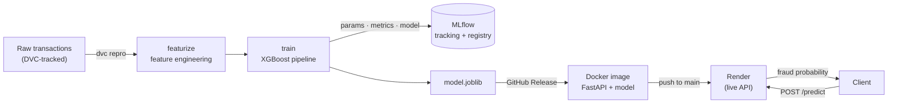

# 🕵️ Fraud Detection — End-to-End MLOps Pipeline

Real-time credit-card fraud detection built to production standards: a reproducible
data pipeline, experiment tracking, a containerized REST API, and a **live public deployment**.

## 🔗 Live demo
- 🎨 **Try it (interactive UI):** https://fraud-detection-mlops-6axyqfmwoyjkfe97zmcpu6.streamlit.app/
- 🔌 **API docs (Swagger):** https://fraud-detection-api-ip6h.onrender.com/docs

> ⏳ Both run on free tiers that sleep when idle — the **first** request may take ~30–60s to wake, then it's instant.


---

## 🎯 What it does
Send a transaction to `POST /predict`, get back a **fraud probability** and a decision — in real time, over HTTP.

```json
// request
{ "amt": 1200, "category": "shopping_net", "gender": "M",
  "trans_date_trans_time": "2020-06-21 03:14:25", "dob": "1990-03-19", "time_since_last": 30 }
// response
{ "fraud_probability": 0.992, "is_fraud": true, "threshold": 0.95 }
```

## 📊 Results
The data is highly imbalanced (**~0.58% fraud**), so the project optimizes **PR-AUC** — the
correct metric for rare-event detection (ROC-AUC is misleadingly optimistic under imbalance).

| Metric | Score |
|---|---|
| **PR-AUC** | **0.905** |
| Precision @ 0.95 | 0.83 |
| Recall @ 0.95 | 0.84 |
| F1 @ 0.95 | 0.83 |

**Model:** XGBoost pipeline with `scale_pos_weight` for imbalance; decision threshold tuned on the
PR curve. **Key signals:** `is_night`, transaction `amount`, merchant `category`, and a
leakage-safe velocity feature (`time_since_last` — seconds since the card's previous transaction).

## 🏗️ Architecture


## 🧰 Tech stack
**ML:** scikit-learn · XGBoost · pandas
**MLOps:** MLflow (tracking + registry) · DVC (data + pipeline versioning)
**Serving:** FastAPI · Uvicorn · Docker · Render
**Quality:** uv · ruff · mypy · pytest · pre-commit · GitHub Actions CI

## 🗂️ Project structure
```
src/fraud_detection/   # package: data, features, model, train, featurize
api/                   # FastAPI serving app
tests/                 # unit tests
dvc.yaml / dvc.lock    # reproducible pipeline (featurize → train)
Dockerfile             # containerized serving image
```

## 🚀 Run it yourself
```bash
uv sync                                   # install deps
dvc repro                                 # reproduce the pipeline (featurize → train)
uv run uvicorn api.main:app --reload      # serve locally → http://127.0.0.1:8000/docs

# …or containerized:
docker build -t fraud-api .
docker run -p 8000:8000 fraud-api
```
> Raw data: [Sparkov simulated transactions](https://www.kaggle.com/datasets/kartik2112/fraud-detection) (`fraudTrain.csv` / `fraudTest.csv`), placed in `data/raw/`.

## 🔁 Reproducible pipeline (DVC)
The full training flow is a versioned DAG. `dvc repro` rebuilds it and **caches unchanged stages**;
`dvc metrics show` reports the results. Data and models live in DVC (out of git); the tiny `.dvc`
pointers and `dvc.lock` are committed, so any commit's exact data + model are reproducible.

## ✅ Implemented
- [x] Data exploration + feature engineering
- [x] XGBoost model, threshold-tuned for imbalance
- [x] Experiment tracking + model registry (MLflow)
- [x] Reproducible data + pipeline versioning (DVC)
- [x] REST API serving (FastAPI)
- [x] Containerization (Docker)
- [x] Live cloud deployment (Render, auto-deploy on push)

## 📸 Screenshots
_MLflow experiment runs · DVC DAG · Swagger `/docs` · a live prediction_
